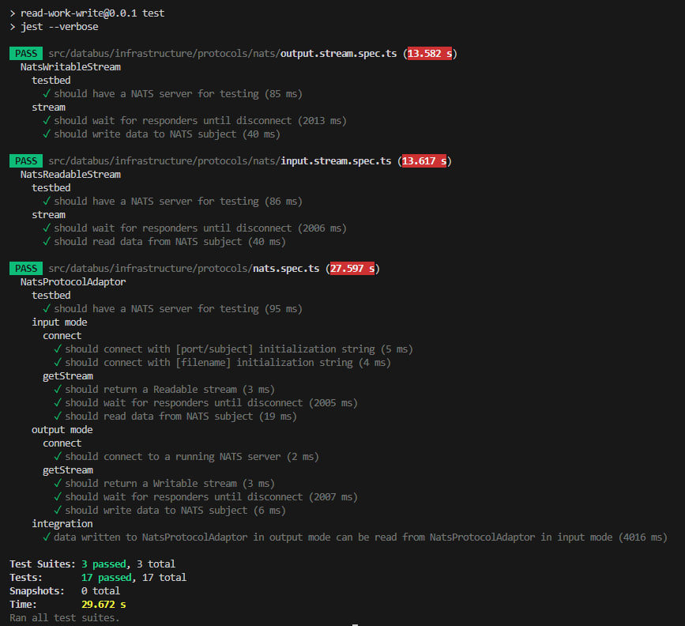

# Обязательная часть:

## Реализовать приложение

Реализовать приложение, которое осуществляет передачу больших объемов данных (например, файлов) через систему обмена сообщениями [NATS](https://nats.io).
Приложение должно состоять из 2х сервисов Reader и Writer, которые можно запустить на разных серверах
(для тестирования можно запускать 2 сервиса на одной машине, главное чтобы использовался выбранный транспорт, в данном случае NATS).
Реализация HTTP части в виде REST API - не обязательна.
Сервис Reader должен осуществлять чтение и передачу данных по заранее выбранному транспорту.
Сервис Writer должен принимать данные от сервиса Reader, обрабатывать их и сохранять.
Сами сервисы можно реализовать без использования фреймворков - nest.js или подобного.

### Реализация

- создать файл `tr -dc 'a-zA-Z0-9\n' </dev/urandom | head -c 50M > temp/sample.txt`
- запустить `docker compose -f "docker.compose.yml" up --build`
- проверить что ничего не потерялось при передаче `md5sum temp/sample.txt temp/copy-over-nats.txt`

## Обработать ситуацию

Обработать ситуацию, когда сервис Reader отправляет сервису Writer больше данных, чем тот может обработать.
Для примера, перед записью в сервисе Writer обрабатывайте входящие данные с помощью этого метода:
```js
const processData = (data) => {
  return new Promise(resolve => {
    setTimeout(() => {
     resolve(data);
    }, 500);
  });
};
```
### Реализация
 
Для NATS здесь выглядит очень уместным использование JetStreams, но JetStreams выступает также хранилищем сообщений, так что для чисто транспортной реализации решено использовать базовое API.

Используется Subscribe/Request, Reader не отправляет следующую партию пока Writer не просигнализирует о готовности ее принять. Так же, если Writer не смог обработать текущую партию по каким-то причинам он может запросить ее заново.

Объем отправляемых в конкретном запросе данных регулируется параметром инициализации [highWaterMark](https://nodejs.org/api/stream.html#new-streamwritableoptions) у выходного потока. Для подбора оптимального значения для конкретной передачи реализовано чтение этого параметра из переменной окружения `NATS_OUT_HWM`. При тестировании скорость передачи быстро упирается в конфигурацию max payload у NATS. 

В базовом `docker.compose.yml` применено стандартное замедление, чтоб поиграть:

- `docker compose -f "docker.compose.yml" up nats reader -d`
- Запуск с 5 секундным slow `docker run --rm -e SLOW=5000 -v ${PWD}/temp:/home/node/temp --net=host writer nats:4222/file-transfer ../temp/slow-copy.txt -w slow --verbose`
 

# Дополнительно (по возможности):

## 1. Реализовать поддержку различных видов транспорта (например websockets). Возможно, дополнительно поддержать обработку различных видов данных.

На данный момент поддерживаются транспорты STD (stdin, stdout), FILE и NATS, так что поддержка различных видов траспорта реализована &#128517;

В основе приложения Node Streams, сама реализация (домен) не делает предположений о передаваемых данных, так что по сути транспорт-адаптеры могут возвращать Stream например в objectMode. 
Worker'ы представляют из себя TransformStream'ы. Объединеняя worker'ы в pipeline'ы приложение может реализовывать интересные трансформации, например:
`input(gRPC) -> toObject -> toDTO -> buisnessLogic -> entity -> postgreSQL`

## 2. Покрыть тестами.

 Реализованы тесты для самой "узкой" части текущей реализации - адаптера NATS

 - [nats.spec.ts](./read-work-write/src/databus/infrastructure/protocols/nats.spec.ts) (20.217 s)
 - [nats/input.stream.spec.ts](./read-work-write/src/databus/infrastructure/protocols/nats/input.stream.spec.ts) (13.753 s)
 - [nats/output.stream.spec.ts](./read-work-write/src/databus/infrastructure/protocols/nats/output.stream.spec.ts) (21.91 s)

 


# Реализация:

[Программирование "на листочке"](./docs/DESIGN_PROPOSAL.md)

CLI приложение со следующим синтаксом:

`<run> [[-w worker]] <source> [target]`

- `<run>` команда на запуск приложения, например `node dist/main` или `docker run --rm reader`
- `-w --worker` потоковый обработчик передаваемых данных, можно передать несколько, порядок имеет значение
  - на  данный момент доступен только `-w gzip`, вызывающий `require('node:zlib').createGzip()`
- аргументы `<source> [target]` - источник и назначение данных. Если указано одно значение оно считаетается источником. Значения имеют вид `ПРОТОКОЛ:НАСТРОЙКИ`, если не указан протокол, но значение не пустое используется протокол `file`, если значение пустое - `std` (stdin для источника, stdout для назначения)

# Scripts

- создать большой файл для теста: `head -c 50M /dev/urandom > temp/sample.txt` или `tr -dc 'a-zA-Z0-9\n' </dev/urandom | head -c 50M > temp/sample.txt` для читабельности
- собрать образы `docker compose -f "docker.compose.yml" up -d --build`
- тестировать разные комбинации передачи:
  - поднять Writer и NATS `docker compose -f "docker.compose.yml" up writer nats`
  - настроить HighWaterMark `docker run --rm -e NATS_OUT_HWM=800 -v ${PWD}/temp:/home/node/temp --net=host reader ../temp/sample.txt nats:4222/file-transfer` (или, например, направить `/dev/urandom` на вход)
- проверить что ничего не потерялось при передаче `md5sum temp/sample.txt temp/copy-over-nats.txt`
- разное:
  - аналог cp: `docker run --rm -v ${PWD}/temp:/home/node/temp reader ../temp/sample.txt ../temp/copy2.txt`
  - аналог cat: `docker run --rm -v ${PWD}/temp:/home/node/temp reader ../temp/sample.txt`
  - аналог sed (добавить обработчиков `-w` по вкусу): `tr -dc 'a-zA-Z0-9' </dev/urandom | head -c 10K | docker run -i --rm -v ${PWD}/temp:/home/node/temp reader
 std ../temp/doc2`


## Debug

- local `cd read-work-write && npm run start:dev -- -- [[-w worker]] <source> [target]`
  - `npm run start:dev -- -- ../temp/sample.txt nats:4222/file-transfer` - reader
- docker `docker compose -f "docker.compose.debug.yml" up -d --build`

## ToDo

- error handling
- proper logging
- offset support