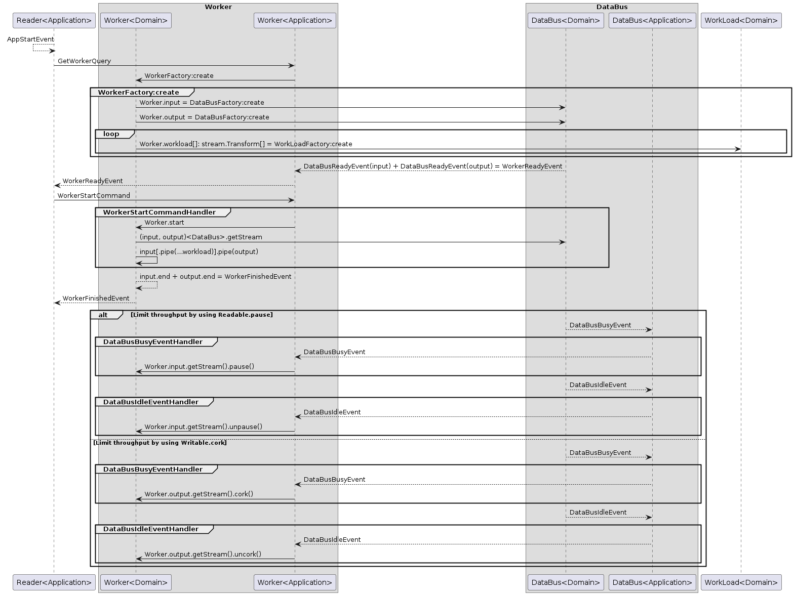

# Архитектура
`Сервис Reader должен осуществлять чтение и передачу данных по заранее выбранному транспорту.`

При такой постановке Reader не самое удачное название, т.к. он осуществляет еще и передачу. Возможно лучше подходит какой-нибудь Transmitter.

Дальнейшая декомпозиция выявляет что модель Read-Work-Write подходит для описания архитектуры как Reader'a так и Writer'a (`Сервис Writer должен принимать данные от сервиса Reader, обрабатывать их и сохранять`).

Модель Read-Work-Write формализуем доменной сущностью Worker (input, output, workload[]).

Для сохранения общего с "бизнесом" языка результирующие приложения будут иметь имена Reader и Writer.

Модель Read-Work-Write перекликается со Streams (Readable,Writable,Transform), в Streams уже реализован механизм контроля потока данных (буфферизации и т.п.).

Предлагаемая базовая модель исполнения:




# Обязательная часть:

## Реализовать приложение

Реализовать приложение, которое осуществляет передачу больших объемов данных (например, файлов) через систему обмена сообщениями [NATS](https://nats.io).
Приложение должно состоять из 2х сервисов Reader и Writer, которые можно запустить на разных серверах
(для тестирования можно запускать 2 сервиса на одной машине, главное чтобы использовался выбранный транспорт, в данном случае NATS).
Реализация HTTP части в виде REST API - не обязательна.
Сервис Reader должен осуществлять чтение и передачу данных по заранее выбранному транспорту.
Сервис Writer должен принимать данные от сервиса Reader, обрабатывать их и сохранять.
Сами сервисы можно реализовать без использования фреймворков - nest.js или подобного.

### Реализация

- создать файл `tr -dc 'a-zA-Z0-9\n' </dev/urandom | head -c 50M > temp/sample.txt`
- запустить `docker compose -f "docker.compose.yml" up --build`
- проверить что ничего не потерялось при передаче `md5sum temp/sample.txt temp/copy-over-nats.txt`

## Обработать ситуацию

Обработать ситуацию, когда сервис Reader отправляет сервису Writer больше данных, чем тот может обработать.
Для примера, перед записью в сервисе Writer обрабатывайте входящие данные с помощью этого метода:
```js
const processData = (data) => {
  return new Promise(resolve => {
    setTimeout(() => {
     resolve(data);
    }, 500);
  });
};
```
### Реализация
 
Для NATS здесь выглядит очень уместным использование JetStreams, но JetStreams выступает также хранилищем сообщений, так что для чисто транспортной реализации решено использовать базовое API.

Используется Subscribe/Request, Reader не отправляет следующую партию пока Writer не просигнализирует о готовности ее принять. Так же, если Writer не смог обработать текущую партию по каким-то причинам он может запросить ее заново.

Объем отправляемых в конкретном запросе данных регулируется параметром инициализации [highWaterMark](https://nodejs.org/api/stream.html#new-streamwritableoptions) у выходного потока. Для подбора оптимального значения для конкретной передачи реализовано чтение этого параметра из переменной окружения `NATS_OUT_HWM`. При тестировании скорость передачи быстро упирается в конфигурацию max payload у NATS. 

В базовом `docker.compose.yml` применено стандартное замедление, чтоб поиграть:

- `docker compose -f "docker.compose.yml" up nats reader -d`
- Запуск с 5 секундным slow `docker run --rm -e SLOW=5000 -v ${PWD}/temp:/home/node/temp --net=host writer nats:4222/file-transfer ../temp/slow-copy.txt -w slow --verbose`
 

# Дополнительно (по возможности):

## 1. Реализовать поддержку различных видов транспорта (например websockets). Возможно, дополнительно поддержать обработку различных видов данных.

На данный момент поддерживаются транспорты STD (stdin, stdout), FILE и NATS, так что поддержка различных видов траспорта реализована &#128517;

В основе приложения Node Streams, сама реализация (домен) не делает предположений о передаваемых данных, так что по сути транспорт-адаптеры могут возвращать Stream например в objectMode. 
Worker'ы представляют из себя TransformStream'ы. Объединеняя worker'ы в pipeline'ы приложение может реализовывать интересные трансформации, например:
`input(gRPC) -> toObject -> toDTO -> buisnessLogic -> entity -> postgreSQL`

## 2. Покрыть тестами.

 Реализованы тесты для самой "узкой" части текущей реализации - адаптера NATS
