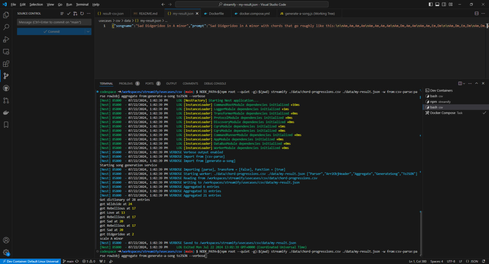

# Building a song generation service from a csv file

Try it out in [Docker](./docker.compose.yml) or in your terminal:

`npm i -g node-streamify csv-parse`

`cd usecases/csv`

`NODE_PATH=$(npm root --quiet -g):$(pwd) streamify ./data/chord-progressions.csv ./data/my-result.json -w from:csv-parse:parse row2obj aggregate from:generate-a-song toJSON`

## Explanation

While searching for a csv to use as an example I came across a [dataset of chord progressions](./data/chord-progressions.csv).

It has descriptions like 'Moody', 'Catchy' mixed with genres like 'Flamenco' and 'Grunge', which practically begs for a song-generating app.

Using `streamify` we already got it, just write our app logic in a [generate-a-song.js](./generate-a-song.js) file and you got yourself a one-command configurable microservice:

## Step-by-step

Call `streamify`. We're going to import global packages (`npm root` part) and a script from `pwd`, so we add these to `NODE_PATH`.

`NODE_PATH=$(npm root --quiet -g):$(pwd) streamify --verbose \` 

Pass our csv file as `streamify` source. Some time later we might want to replace it with an AI-generation web service and will be able to do so with ease.

`./data/chord-progressions.csv \` 

We'll use third-party [library](https://csv.js.org/parse/) which we installed earlier via `npm i csv-parse`. Why reinvent the bike, right?

`-w from:csv-parse:parse \` 

Add some built-in `streamify` workers to trasform arrays to objects and pack them into an array.

`-w row2obj -w aggregate \` 

Thus, we got ourselves a database for our generator to make decisions upon.

So, we expect array of `{"1st chord","2nd chord","3rd chord","4th chord","Progression Quality","Genre"}` string maps as input for the next worker.

Write our song-generating logic into [generate-a-song.js](./generate-a-song.js) file and add it to pipeline.

`-w generate-a-song \` 

This worker will output a sing in a `{songname: string, prompt: string, lines: Chord[4][1,4][]}` object for next workers in line to transform. 

Here, for example, we extract `prompt` property of our song and save it to a [file](./data/Wistful-Grunge-in-A-minor.json) (`streamify` destination) to use it for AI-generation later.

`-w extract:prompt ../temp/last-prompt.txt`

Now that I think of it, prompt generation should've rather been a pipeline step of its own... 
Furthermore, the song generation part could be split into well-defined steps, like `pick-genre`, `pick-mutation`, `apply-mutation`, `verse`, `chorus`, etc.
Well, good enough for an example, designed to illustrate using csv as source.
